  

<a href="https://portfolio-v2-tau-ochre.vercel.app"><strong>PORTFOLIO</strong></a>
&nbsp;&nbsp;·&nbsp;&nbsp;
<a href="https://github.com/admoujta"><strong>GITHUB</strong></a>
&nbsp;&nbsp;·&nbsp;&nbsp;
<a href="https://www.linkedin.com/in/adam-moujtahid-0416b019a/"><strong>LINKEDIN</strong></a>
&nbsp;&nbsp;·&nbsp;&nbsp;
<a href="./STACK.md"><strong>TECH STACK</strong></a>

  

Computer Engineering & Networks · AI · Big Data · Linux

 

## Tech Stack

 

  

<a href="./STACK.md"><strong>View complete stack →</strong></a>

 

## Featured Work

**01 — [Adam Moujtahid Portfolio](https://portfolio-v2-tau-ochre.vercel.app)**  
Modern personal portfolio focused on projects, engineering, Big Data and AI.  
[Source code →](https://github.com/admoujta/adam-moujtahid-portfolio)

**02 — [1337 Pool](https://github.com/admoujta/1337---Pool)**  
C, Shell, Unix fundamentals, algorithms and problem solving.

**03 — [Libft](https://github.com/admoujta/Libft)**  
Core C library rebuilt from scratch to strengthen low-level programming foundations.

**04 — [Portail Absence](https://github.com/admoujta/Portail-Absence)**  
Django-based web application for absence management.

**05 — [Management Event](https://github.com/admoujta/Management-Event)**  
Web application focused on event management and frontend/backend workflows.

 

## Portfolio

### [Visit Adam Moujtahid's Portfolio →](https://portfolio-v2-tau-ochre.vercel.app)

Projects · Skills · Academic Journey · Certifications · Contact

 

## Contribution Activity

  

**Building strong foundations today. Engineering intelligent systems tomorrow.**

